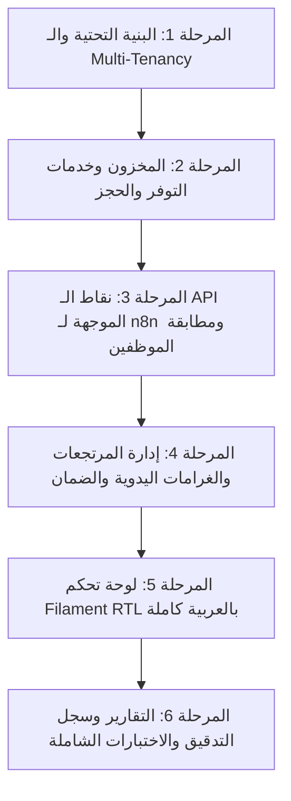

# Master Implementation Plan — SuitRent SaaS (Laravel Backend & Filament RTL)

> **وثيقة خطة التنفيذ المعتمدة للمشروع**  
> تم تخصيص هذه الخطة لتنفيذ الجزء الخاص بـ **Laravel Framework & Filament Dashboard & Internal REST API** بالكامل، مع الاستبعاد التام لأي كود يخص معالجة الصوت، نماذج الذكاء الاصطناعي، أو محاكي التيليجرام داخل لارافيل (حيث يتولى **n8n** هذه المهام خارجياً).

---

## 1. ملخص المعمارية والمحددات الصارمة (Architecture & Constraints)

1. **نطاق لارافيل الحصري:**
   - لوحة تحكم عصرية تدعم العربية واتجاه اليمين لليسار (RTL) مبنية بـ Filament.
   - نقاط نهاية REST API داخلية موجهة لربط n8n (فحص التوفر، إنشاء الحجوزات، الاستعلام عن المخزون وجدول اليوم).
   - إدارة كاملة للمخزون، المرتجعات، بطاقات الهوية، سجلات التدقيق، والتقارير المالية.
2. **المستبعدات تماماً من لارافيل:**
   - ❌ لا يوجد محاكي أو بوت تيليجرام تفاعلي داخل لارافيل.
   - ❌ لا توجد أي معالجة للصوت (Whisper) أو تفريغ نصي داخل لارافيل.
   - ❌ لا توجد أي مناداة لنماذج الذكاء الاصطناعي (OpenAI GPT / Claude) داخل لارافيل.
   - ⚡ سيناريو n8n الخارجي هو الذي يستقبل صوت/نص تيليجرام، ويستدعي الذكاء الاصطناعي، ثم يرسل استدعاءات مهيكلة بصيغة JSON لـ API لارافيل.
3. **المصادقة والأدوار:**
   - دخول لوحة التحكم لمالك المتجر بالبريد الإلكتروني وكلمة المرور فقط (**تم إلغاء شرط 2FA TOTP لتسهيل الاستخدام**).
   - التحقق من موظفي تيليجرام عبر n8n يتم بمجرد **مطابقة `telegram_user_id`** الممرر مع المعرفات المسجلة مسبقاً لموظفي المتجر (`tenant_id`).
4. **التسعير والغرامات اليدوية:**
   - تسعير الحجز (إجمالي الإيجار، الدفعة المقدمة، المتبقي) يُحدد **يدوياً** من المالك/الموظف.
   - تقدير غرامات التأخير أو التلف/الفقدان يتم **يدوياً** مع تدوين السبب والملاحظات.
5. **سلامة البيانات ومنع الحجز المزدوج:**
   - قاعدة البيانات: **PostgreSQL**.
   - منع الحجز المزدوج بنسبة 100% عبر قفل السجلات `SELECT ... FOR UPDATE` في خدمة `BookingService` داخل Transaction.
   - عزل المتاجر (Multi-Tenancy) عبر `tenant_id` على كافة الجداول مع Global Scope.
   - بطاقة الهوية: تسجيل حالة فقط (`held` / `released`) وملاحظات نصية، دون تخزين أو مسح أرقام أو صور الهويات.

---

## 2. فهرس المواصفات والمهام (Specs Index & Mapping)

| رقم المواصفة | العنوان | النطاق في لارافيل | حالة المواصفة |
|---|---|---|---|
| **SPEC-001** | Multi-Tenant Architecture & Data Isolation | هيكلة الجداول مع `tenant_id` و Global Scope وعزل المتاجر | مخصصة ومطابقة |
| **SPEC-002** | Authentication, RBAC & Telegram Whitelist | مصادقة البريد/كلمة المرور للمالك + مطابقة `telegram_user_id` لموظفي المتجر | مخصصة (إلغاء 2FA) |
| **SPEC-003** | Web Admin Dashboard (Filament Arabic/RTL) | لوحة تحكم عصرية متجاوبة باللغة العربية لإدارة المخزون والحجوزات والموظفين | مخصصة ومطابقة |
| **SPEC-004** | Booking Backend & Availability API for n8n | نقاط API لفحص التوفر وإنشاء الحجز وقفل السجلات (التسعير اليدوي) | مخصصة (حذف STT/AI) |
| **SPEC-005** | Automated Cleaning Buffer Management | حساب فترات التنظيف وجدول تحويل القطع إلى متاحة تلقائياً | مخصصة ومطابقة |
| **SPEC-006** | Return & Inspection Workflow | قائمة فحص القطع، تقدير الغرامة يدوياً، وقفل فك حجز الهوية حتى التسوية | مخصصة ومطابقة |
| **SPEC-007** | Financial Tracking & Reporting | تتبع الإيجار، الدفعات، المتبقي، طرق الدفع اليدوية (Cash, PalPay, Jawwal Pay) | مخصصة ومطابقة |
| **SPEC-008** | Audit Logging & Traceability | سجل تدقيق غير قابل للتعديل لكافة العمليات الحساسة بـ ActivityLog | مخصصة ومطابقة |

---

## 3. مراحل التنفيذ التفصيلية (Implementation Roadmap)

---

### المرحلة 1: البنية التحتية، الحزم، وقاعدة البيانات (SPEC-001 & SPEC-002)
- [ ] تثبيت وتحديث حزم المشروع المطلوبة (`filament/filament`, `spatie/laravel-activitylog`, `stancl/tenancy`).
- [ ] إعداد الاتصال بقاعدة بيانات PostgreSQL في ملف `.env`.
- [ ] إنشاء Migration لجدول المستأجرين `tenants` (uuid, name, slug, settings jsonb, is_active).
- [ ] إنشاء Migration لجدول المستخدمين `users` (uuid, tenant_id, name, email, password, role: owner/staff, telegram_user_id: bigint nullable, is_active).
- [ ] تطبيق `TenantScope` و `BelongsToTenant` Trait لضمان الفلترة التلقائية لكافة الاستعلامات.
- [ ] إعداد المصادقة الأساسية (Session-based Auth بالبريد وكلمة المرور).
- [ ] كتابة اختبارات عزل المتاجر وصحة الفلترة التلقائية.

---

### المرحلة 2: إدارة المخزون، التوفر، والحجز المقفل (SPEC-001, SPEC-004, SPEC-005)
- [ ] إنشاء Migration ونموذج `Item` (uuid, tenant_id, name, category, size, color, status, custom_fields jsonb).
- [ ] إنشاء Migration ونموذج `Booking` (uuid, tenant_id, customer_name, customer_phone, pickup_date, return_date, status, total_fee, advance_paid, remaining_balance, payment_method, alterations_notes, created_by).
- [ ] إنشاء Migration ونموذج `BookingItem` (uuid, tenant_id, booking_id, item_id, rental_price, inspection_status).
- [ ] إنشاء Migration ونموذج `CollateralRecord` (uuid, tenant_id, booking_id, status: held/released, notes, held_at, released_at).
- [ ] تطوير `AvailabilityService`:
  - فحص توفر القطع في النطاق الزمني المطلوب.
  - حساب فترة التنظيف `buffer_hours` (الافتراضي 48 ساعة من إعدادات المتجر).
- [ ] تطوير `BookingService`:
  - قفل عناصر المخزون المطلوبة ترتيباً تصاعدياً باستخدام `SELECT ... FOR UPDATE`.
  - إعادة التحقق من التوفر داخل الـ Transaction لمنع التضارب الزمني.
  - حفظ الحجز ومفرداته وإنشاء سجل الضمان `held`.
- [ ] كتابة اختبارات منع الحجز المزدوج التزامني `test_simultaneous_booking_requests_prevent_double_booking`.

---

### المرحلة 3: نقاط الـ API الخاصة بربط n8n (SPEC-004 & SPEC-002)
- [ ] بناء Middleware للتحقق من هوية موظف التيليجرام:
  - التحقق من وجود رأس طلب أو حقل `telegram_user_id`.
  - مطابقة المعرف مع مستخدم نشط في جدول `users` لنفس المتجر وتعيين المتجر وسياق المستخدم للطلب.
  - رفض الطلب بكود `401/403` في حال عدم وجود المعرف في القائمة المعتمدة للمتجر.
- [ ] برمجة Endpoint: `POST /api/v1/availability/check`:
  - يستقبل مصفوفة `item_ids` وتواريخ `pickup_date` و `return_date`.
  - يرجع حالة توفر كل عنصر بدقة (متاح / محجوز / في فترة تنظيف مع تاريخ الجاهزية).
- [ ] برمجة Endpoint: `POST /api/v1/bookings`:
  - يستقبل بيانات الحجز المستخرجة بواسطة n8n مع المبالغ المحددة يدوياً.
  - تنفيذ عملية الحجز المقفلة وإرجاع كود الحجز وتفاصيل التأكيد كـ JSON مهيكل.
- [ ] برمجة Endpoint: `GET /api/v1/bookings/today`:
  - جلب مواعيد تسليم واستلام اليوم لمساعدة الموظف عبر تيليجرام.
- [ ] برمجة Endpoint: `GET /api/v1/items`:
  - استعراض والبحث في عناصر المخزون للمتجر.

---

### المرحلة 4: معالجة المرتجعات، فحص القطع، وتقدير الغرامات اليدوي (SPEC-006 & SPEC-005)
- [ ] تطوير `ReturnService`:
  - استعراض كافة عناصر الحجز للتحقق منها.
  - تسجيل حالة كل قطعة: `clean_pass` (سليم)، `damaged` (تالف)، `missing` (مفقود).
  - في حال وجود تلف أو فقدان: إدخال مبلغ الغرامة يدوياً وسبب التقدير، وتحويل الحجز إلى `damage_pending`.
  - القطع السليمة المرتجعة تتحول تلقائياً إلى حالة `cleaning`.
  - حظر فك حجز بطاقة الهوية (`collateral_records`) إذا كان هناك رصيد إيجار متبقٍ أو غرامة غير مسددة.
- [ ] فك حجز الهوية (`POST /api/v1/bookings/{id}/collateral/release` أو عبر لوحة التحكم) بعد سداد كامل المستحقات.
- [ ] جدولة تحويل القطع المنتهية فترة تنظيفها إلى `available` عبر Artisan Command مجدول (`php artisan buffer:release-clean-items`).

---

### المرحلة 5: لوحة تحكم Filament عصرية باللغة العربية RTL (SPEC-003)
- [ ] تكوين Filament Admin Panel مع تفعيل دعم العربية واتجاه اليمين لليسار (RTL).
- [ ] تصميم واجهة مستخدم متميزة ذات طابع احترافي بألوان أنيقة ومريحة للعين.
- [ ] صفحة رئيسية (Dashboard Widgets):
  - حجوزات اليوم والتسليمات المتوقعة.
  - القطع قيد التنظيف وتواريخ جاهزيتها.
  - المستحقات المالية المعلقة والغرامات.
  - الإيرادات المحصلة.
- [ ] إدارة المخزون (`ItemResource`):
  - قائمة مريحة، تصنيفات، مقاسات، ألوان، وحقول مخصصة (JSONB).
- [ ] إدارة الحجوزات (`BookingResource`):
  - نموذج حجز يدوي مباشر من اللوحة.
  - واجهة معالجة الإرجاع والفحص خطوة بخطوة مع إدخال الغرامة اليدوية.
  - إدارة حالة بطاقة الهوية وحظر تسليمها قبل السداد.
- [ ] إدارة الموظفين وقائمة معرّفات تيليجرام (`UserResource`):
  - إضافة وتعديل بيانات الموظفين وتعيين `telegram_user_id` لكل موظف.
- [ ] إعدادات المتجر (`TenantSettings`):
  - تحديد مدة التنظيف الافتراضية بالساعات والعملة الرسمية.

---

### المرحلة 6: التقارير المالية، سجل التدقيق، وضمان الجودة (SPEC-007 & SPEC-008)
- [ ] تقارير مالية ميسرة:
  - تقرير يومي / أسبوعي / شهري يوضح الإيرادات، المبالغ المتبقية، والغرامات المحصلة.
  - تصنيف المبالغ حسب طريقة الدفع (كاش، Jawwal Pay، PalPay، تحويل بنكي).
- [ ] سجل التدقيق (`AuditLogResource`):
  - ربط مكتبة Spatie Activitylog لتسجيل كافة عمليات الحجز، الإرجاع، الغرامات، وفك بطاقات الهوية تلقائياً مع معرّف الفاعل والوقت.
  - صفحة عرض محمية للمالك فقط للقراءة وغير قابلة للتعديل أو الحذف.
- [ ] تنفيذ اختبارات الوحدة واختبارات التكامل الشاملة (`php artisan test`).
- [ ] تنسيق وضبط الكود باستخدام Laravel Pint (`vendor/bin/pint --format agent`).

---

## 4. خطة الاسترجاع والأمان (Rollback & Data Safety)
- كافة العمليات المالية والحجوزات تستخدم PostgreSQL Transactions الذرية (Atomic).
- لا يتم حذف بيانات الحجوزات أو سجلات التدقيق عند التعديل، بل يتم الاعتماد على الحالات والتسجيل التراكمي.
- في بيئة الإنتاج يتم استخدام Migrations تصاعدية دون إجراءات تدميرية.
