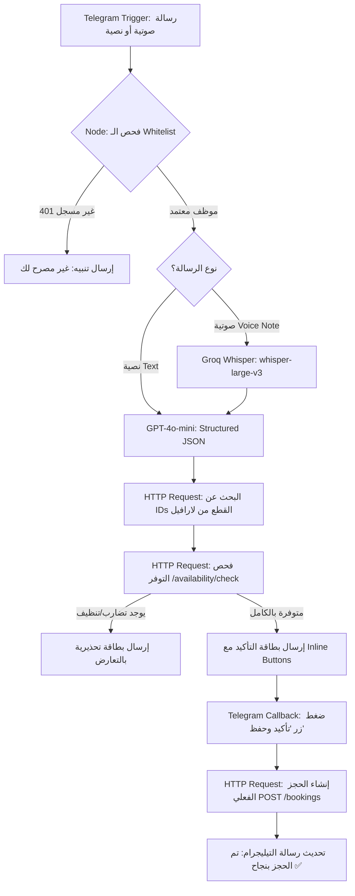

# دليل تنفيذ عقد سير عمل n8n لبوت تيليجرام (Telegram Voice & Booking Pipeline)

> **المشروع:** نظام إدارة وحجوزات محلات بدلات المناسبات (SuitRent SaaS)  
> **المرجع:** [MASTER_IMPLEMENTATION_PLAN.md](file:///d:/mind-ai/occasion-suit-bookings/docs/ai-sdlc/MASTER_IMPLEMENTATION_PLAN.md) و [intent/voice-booking-telegram.md](file:///d:/mind-ai/occasion-suit-bookings/intent/voice-booking-telegram.md) و [SPEC-004.md](file:///d:/mind-ai/occasion-suit-bookings/docs/ai-sdlc/specs/SPEC-004.md)  
> **تاريخ التوثيق:** 2026-10-10  

---

## 1. المعمارية وخط الأنابيب (Pipeline Flow)



---

## 2. التجهيزات المسبقة والاعتمادات (Credentials)

1. **Telegram API Account:**
   - إنشاء بوت جديد عبر `@BotFather` واستخراج الـ `BOT_TOKEN`.
2. **Groq API Key:**
   - لاستخدام نموذج التفريغ السريع `whisper-large-v3` (< 1.5 ثانية).
3. **OpenAI API Key:**
   - لاستخدام نموذج الاستخراج المهيكل `gpt-4o-mini` (أو Haiku كبديل).
4. **خادم لارافيل (Laravel Internal Base URL):**
   - محلياً: `http://localhost:8000` أو عبر نفق (Cloudflare Tunnel / Ngrok).
   - بيئة الإنتاج: `http://127.0.0.1:8000` (على نفس الـ VPS).

---

## 3. تفاصيل عقد سير العمل (Node-by-Node Specification)

### العقدة 1: استقبال الرسائل (`Telegram Trigger`)
- **النوع:** `Telegram Trigger`
- **الأحداث المستمعة (Updates):** `message`, `callback_query`
- **الوظيفة:** استقبال كافة الرسائل الواردة من موظف المتجر (محادثة خاصة 1-on-1 فقط).

---

### العقدة 2: الفرز الأولي والتوجيه (`Switch: Message vs Callback`)
- **النوع:** `Switch`
- **القواعد:**
  1. **المسار الأول (Callback Query):** تحقق من وجود `{{ $json.callback_query }}` (تفاعل الموظف مع أزرار التأكيد/الإلغاء).
  2. **المسار الثاني (New Message):** تحقق من وجود `{{ $json.message }}` (رسالة جديدة قادمة للتسجيل).

---

### العقدة 3: التحقق الأمني من معرف الموظف (`Whitelist Guard`)
- **النوع:** `Code Node`
- **الوظيفة:** استخراج معرف الموظف `telegram_user_id` لتمريره في كافة طلبات API لارافيل:
```javascript
const telegramUserId = $json.message ? $json.message.from.id : $json.callback_query.from.id;
const chatId = $json.message ? $json.message.chat.id : $json.callback_query.message.chat.id;

return {
    telegramUserId,
    chatId,
    payload: $json
};
```
> **ملاحظة:** وسيط لارافيل `TelegramStaffAuth` يتحقق تلقائياً من وجود المعرف في جدول المستخدمين التابعين للمتجر ونشاط الحساب، ويرفض الطلب برمز `401/403` في حال عدم وجود صلاحية.

---

### العقدة 4: معالجة الرسائل الصوتية (`Groq Whisper STT`)
*تُنفذ فقط إذا كانت الرسالة صوتية `{{ $json.payload.message.voice }}`:*
1. **تحميل الملف `Telegram: Get File`:**
   - **Resource:** `File`
   - **Operation:** `Get`
   - **File ID:** `{{ $json.payload.message.voice.file_id }}`
2. **التفريغ النصي `HTTP Request: Groq Whisper`:**
   - **Method:** `POST`
   - **URL:** `https://api.groq.com/openai/v1/audio/transcriptions`
   - **Headers:** `Authorization: Bearer <GROQ_API_KEY>`
   - **Body Type:** `Form-Data (Multipart)`
   - **Parameters:**
     - `file`: الملف الصوتي (Binary)
     - `model`: `whisper-large-v3`
     - `language`: `ar`
     - `response_format`: `json`
   - **المخرجات:** نص التفريغ العربي الصريح.

---

### العقدة 5: استخراج الكيانات المهيكلة (`OpenAI GPT-4o-mini`)
- **النوع:** `OpenAI` / `HTTP Request`
- **النموذج:** `gpt-4o-mini`
- **Temperature:** `0.1`
- **System Prompt:**
  ```text
  أنت مساعد ذكي لاستخراج بيانات حجوزات بدلات الأعراس والمناسبات من النصوص والتسجيلات الصوتية باللهجة الفلسطينية والعربية.
  استخرج بيانات العميل، أرقام الهواتف، المقاسات، والتواريخ بدقة كاملة بصيغة JSON الصريحة وفق الـ Schema المحددة فقط.
  إذا كان هناك تاريخ ناقص، ضعه null دون اختلاق بيانات.
  ```
- **Response Format Schema (JSON Schema):**
  ```json
  {
    "type": "object",
    "properties": {
      "customer_name": { "type": "string" },
      "customer_phone": { "type": "string" },
      "suit_name": { "type": "string" },
      "suit_size": { "type": "string" },
      "color": { "type": "string" },
      "pickup_date": { "type": "string", "format": "date" },
      "return_date": { "type": "string", "format": "date" },
      "total_fee": { "type": "number" },
      "advance_paid": { "type": "number" },
      "payment_method": { "type": "string", "enum": ["cash", "palpay", "jawwal_pay", "bank_transfer"] },
      "alterations_notes": { "type": "string" }
    },
    "required": ["customer_name", "customer_phone", "pickup_date", "return_date", "total_fee"]
  }
  ```

---

### العقدة 6: مطابقة عناصر المخزون (`HTTP Request: Item Lookup`)
- **النوع:** `HTTP Request`
- **Method:** `GET`
- **URL:** `{{ $env.LARAVEL_API_URL }}/api/v1/items`
- **Headers:**
  - `X-Telegram-User-Id`: `{{ $json.telegramUserId }}`
  - `Accept`: `application/json`
- **Query Parameters:**
  - `search`: `{{ $json.extracted.suit_name }}`
  - `size`: `{{ $json.extracted.suit_size }}`
- **النتيجة:** استخراج معرّف القطعة الداخلي (`UUID`).

---

### العقدة 7: فحص التوفر والـ Buffer (`HTTP Request: Availability Check`)
- **النوع:** `HTTP Request`
- **Method:** `POST`
- **URL:** `{{ $env.LARAVEL_API_URL }}/api/v1/availability/check`
- **Headers:**
  - `X-Telegram-User-Id`: `{{ $json.telegramUserId }}`
  - `Content-Type`: `application/json`
  - `Accept`: `application/json`
- **Body (JSON):**
  ```json
  {
    "item_ids": ["{{ $json.matched_item_id }}"],
    "pickup_date": "{{ $json.extracted.pickup_date }}",
    "return_date": "{{ $json.extracted.return_date }}"
  }
  ```
- **النتيجة:** استلام حالة التوفر (`available: true/false`).

---

### العقدة 8: إرسال بطاقة المراجعة والتأكيد (`Telegram: Confirmation Card`)
- **النوع:** `Telegram` -> `Send Message`
- **Chat ID:** `{{ $json.chatId }}`
- **النص (Markdown RTL):**
  ```markdown
  📋 *تفاصيل الحجز المقترح:*

  👤 *العميل:* {{ $json.extracted.customer_name }}
  📱 *الهاتف:* {{ $json.extracted.customer_phone }}
  👔 *القطعة:* {{ $json.extracted.suit_name }} (مقاس: {{ $json.extracted.suit_size }})
  🗓️ *تاريخ الاستلام:* {{ $json.extracted.pickup_date }}
  🗓️ *تاريخ الإرجاع:* {{ $json.extracted.return_date }}
  💰 *إجمالي الإيجار:* {{ $json.extracted.total_fee }} ₪
  💵 *الدفعة المقدمة:* {{ $json.extracted.advance_paid }} ₪ ({{ $json.extracted.payment_method }})
  📝 *التعديلات:* {{ $json.extracted.alterations_notes }}

  {{ $json.is_available ? '✅ جميع القطع متوفرة وجاهزة للحجز' : '⚠️ تنبيه: القطعة محجوزة مسبقاً أو قيد فترة التنظيف!' }}
  ```
- **أزرار الرد التفاعلية (Inline Keyboard):**
  ```json
  {
    "inline_keyboard": [
      [
        {
          "text": "✅ تأكيد وحفظ الحجز",
          "callback_data": "confirm_booking_{{ $json.session_id }}"
        },
        {
          "text": "❌ إلغاء",
          "callback_data": "cancel_booking_{{ $json.session_id }}"
        }
      ]
    ]
  }
  ```

---

### العقدة 9: إتمام الحجز عند التأكيد (`HTTP Request: Store Booking`)
*تُستدعى عندما يضغط الموظف زر "تأكيد وحفظ" من مسار الـ Callback Query:*
- **Method:** `POST`
- **URL:** `{{ $env.LARAVEL_API_URL }}/api/v1/bookings`
- **Headers:**
  - `X-Telegram-User-Id`: `{{ $json.telegramUserId }}`
  - `Content-Type`: `application/json`
  - `Accept`: `application/json`
- **Body (JSON):**
  ```json
  {
    "customer_name": "{{ $json.session_data.customer_name }}",
    "customer_phone": "{{ $json.session_data.customer_phone }}",
    "pickup_date": "{{ $json.session_data.pickup_date }}",
    "return_date": "{{ $json.session_data.return_date }}",
    "total_fee": {{ $json.session_data.total_fee }},
    "advance_paid": {{ $json.session_data.advance_paid }},
    "payment_method": "{{ $json.session_data.payment_method }}",
    "alterations_notes": "{{ $json.session_data.alterations_notes }}",
    "item_ids": ["{{ $json.session_data.item_id }}"]
  }
  ```
- **الاستجابة:**
  تقوم لارافيل بتنفيذ عملية ذرية (ACID Transaction) مع قفل السجلات `SELECT ... FOR UPDATE` وإنشاء سجل ضمان الهوية `held`، وإرجاع كود الحجز.

---

### العقدة 10: تحديث الرسالة وتأكيد العملية (`Telegram: Edit Message`)
- **النوع:** `Telegram` -> `Edit Message Text`
- **النص النهائي:**
  ```markdown
  ✅ *تم تأكيد الحجز وحفظه في النظام بنجاح!*

  🔖 *رقم الحجز:* `{{ $json.booking_number }}`
  👤 *العميل:* {{ $json.customer_name }}
  💵 *المتبقي للتحصيل:* {{ $json.remaining_balance }} ₪
  🪪 *حالة الضمان:* تم تسجيل حجز الهوية الوطنية في الخزنة تلقائياً.
  ```

---

## 4. جدول معالجة الأخطاء (Error Handling Matrix)

| الحالة | المعالجة في n8n | الرسالة للموظف |
|---|---|---|
| **موظف غير مسجل (401/403)** | إيقاف المعالجة فوراً دون استدعاء الذكاء الاصطناعي | "⚠️ عذراً، حساب التيليجرام الخاص بك غير مسجل أو غير مفعّل في متجر SuitRent." |
| **صوت غير واضح / STT فشل** | عدم اختلاق بيانات | "لم أتمكن من تفريغ الصوت بوضوح، يرجى إعادة التسجيل بنبرة أوضح أو كتابة التفاصيل نصياً." |
| **تعارض زمني (409 Conflict)** | تعطيل زر التأكيد | "⚠️ لا يمكن الحجز: القطعة المطلوبة محجوزة لعميل آخر أو تقع ضمن فترة التنظيف والتعقيم (Turnaround Buffer)." |
| **بيانات أساسية مفقودة (تاريخ الإرجاع مثلاً)** | إرسال تنبيه بالحقل الناقص | "يرجى تحديد تاريخ إرجاع البدلة المتوقع لإتمام فحص التوفر." |
